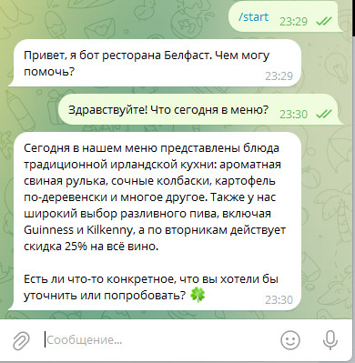
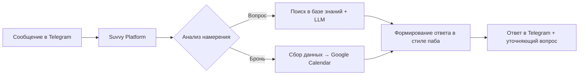

# 🍀 AI Restaurant Assistant — «Белфаст»

> Интеллектуальный ИИ-ассистент для паба «Белфаст» (Москва) с поддержкой естественного диалога, ответов на вопросы по базе знаний и автоматической записи клиентов в Google Календарь. Работает в мессенджере **Telegram**.

---

## 📋 Оглавление

- [О проекте](#-о-проекте)
- [Функционал](#-функционал)
- [Технологический стек](#-технологический-стек)
- [Как это работает](#-как-это-работает)
- [Настройка и запуск](#-настройка-и-запуск)
- [Системный промпт](#-системный-промпт)
- [Примеры диалогов](#-примеры-диалогов)
- [Планы развития](#-планы-развития)
- [Лицензия](#-лицензия)

---

## 🍺 О проекте

**AI Restaurant Assistant** — это виртуальный администратор для аутентичного ирландского паба «Белфаст» в Москве. Ассистент помогает гостям прямо в **Telegram**:

- 🗣️ Вести естественный диалог в тёплом, гостеприимном стиле
- ❓ Получать ответы на вопросы о меню, акциях, часах работы и парковке
- 📅 Бронировать столик с автоматическим добавлением события в Google Календарь
- 🔄 Получать альтернативные предложения при недоступности запрошенного времени

Проект демонстрирует, как с помощью no-code платформы **Suvvy.ai** и интегрированной языковой модели можно быстро создать специализированного чат-бота для сферы гостеприимства — без написания кода и сложной инфраструктуры.

---

## Скриншот бота:

## ⚡ Функционал

| Возможность | Описание |
|-------------|----------|
| 🤖 Умный диалог | Поддержка контекста, понимание намерений, ответы на языке пользователя |
| 📚 База знаний | Ответы на вопросы по меню, акциям, правилам заведения на основе промпта |
| 📅 Интеграция с календарём | Сбор данных для брони и добавление встречи в Google Calendar |
| 💬 Telegram-интерфейс | Полноценное общение с гостями в привычном мессенджере |
| 🎯 Сценарии бронирования | Пошаговый сбор: дата/время → количество гостей → контакты → подтверждение |
| 🔄 Обработка недоступности | Предложение альтернативных дат и времени при занятости слота |
| 🌍 Мультиязычность | Автоматическое определение и ответ на языке собеседника |

---

## 🛠️ Технологический стек

| Компонент | Технология / Сервис |
| :--- | :--- |
| 🤖 Платформа | [Suvvy.ai](https://suvvy.ai/) — no-code конструктор ИИ-ассистентов |
| 🧠 Языковая модель | Интегрированная LLM, доступная в платформе Suvvy |
| 🔗 Интеграции | Google Calendar (через аккаунт Google), Telegram |
| 🌐 Канал связи | Мессенджер Telegram (бот) |
| 🎨 Стиль общения | Дружелюбный, с элементами ирландского колорита 🍀 |

---

## 🔄 Как это работает

### Основные этапы обработки:

1. **Гость пишет в Telegram-бота** → Suvvy принимает сообщение
2. **Анализ интента** → определение: вопрос / бронь / иное
3. **Генерация ответа**:
    - 📚 Если вопрос → поиск в базе знаний + генерация через интегрированную языковую модель
    - 📅 Если бронь → валидация слота → запись в Google Calendar → подтверждение
4. **Форматирование** → применение стиля: эмодзи, короткие абзацы, акценты
5. **Отправка ответа в Telegram** + уточняющий вопрос для продолжения диалога

---

## ⚙️ Настройка и запуск

### ✅ Предварительные требования

- Аккаунт на [Suvvy.ai](https://suvvy.ai/)
- Аккаунт Google (для подключения календаря)
- Аккаунт Telegram (для создания бота и получения токена)

### 🚀 Пошаговая настройка

#### 1️⃣ Создайте бота в Telegram

- Напишите [@BotFather](https://t.me/BotFather) в Telegram
- Отправьте команду `/newbot`, задайте имя и юзернейм
- Скопируйте полученный **API Token**

#### 2️⃣ Настройте ассистента в Suvvy

- Перейдите в [Suvvy Dashboard](https://suvvy.ai/)
- Создайте нового ассистента
- **Выберите доступную модель** из предложенных в платформе
- Вставьте системный промпт из раздела [Системный промпт](#-системный-промпт)
- Загрузите базу знаний: меню, акции, FAQ

#### 3️⃣ Подключите интеграции

- **Telegram**: в настройках бота в Suvvy укажите токен от @BotFather
- **Google Calendar**: авторизуйте ваш Google-аккаунт в разделе интеграций Suvvy
  - Предоставьте доступ к календарю паба
  - Укажите название календаря для записи броней

#### 4️⃣ Протестируйте и запустите

- Откройте диалог с вашим ботом в Telegram
- Проверьте сценарии: приветствие, вопрос по меню, бронирование
- При необходимости скорректируйте промпт или базу знаний в интерфейсе Suvvy

> 💡 **Важно**: Весь проект настраивается через веб-интерфейс — без кода, без серверов, без деплоя.
 
## 📜 Системный промпт (ключевые блоки)

> Полный промпт хранится в файле `prompts/system_prompt.md`

### 📅 Часы работы и акции (автоматически подставляются)

|День|Время|
|---|---|
|Пн–Чт|12:00–00:00|
|Пт|12:00–02:00|
|Сб|15:00–02:00|
|Вс|15:00–00:00|

🎁 **Акции**: День рождения (пинта + скидка 20%), Пн/Вс (2+1 на пиво), Вт (вино -25%), Ср (рулька -25%), Вс («Пиратское сокровище» -25%)

---

## 💬 Примеры диалогов

## 📌 Бронирование столика

**Гость:** Хочу забронировать столик на пятницу вечером  
**Ассистент:** *Sláinte! 🍻* С удовольствием помогу. На какую дату и время планируете визит?  
**Гость:** 15 марта, 19:00, нас будет 4 человека  
**Ассистент:** *Отлично! 🎉* Есть свободные столики на 15 марта в 19:00 на 4 персоны.  
Подскажите ваше имя и номер телефона для подтверждения брони?

## 📌 Вопрос по акциям

**Гость:** Какие у вас есть скидки?  
**Ассистент:** *🍀 У нас несколько приятных акций:*  
- **🎂 День рождения:** бесплатная пинта + скидка 20% (в день и неделю после)  
- **🍺 Пн и Вс:** 2+1 на классическое пиво  
- **🍷 Вт:** вино -25% | **🍖 Ср:** рулька -25%  

А на какой день планируете визит? Подберём самую выгодную опцию! 😊

## 📌 Обработка недоступности слота

**Гость:** Можно забронировать на субботу в 20:00?  
**Ассистент:** К сожалению, на 20:00 в субботу столики уже заняты 🍀  
Но есть свободные места в **18:30 или 21:15** — подойдёт одно из этих времён?

## 🚀 Планы развития

- Передача сложных запросов менеджеру (уведомление в Telegram/почту)
- Поддержка дополнительных мессенджеров (WhatsApp, VK Мессенджер)
- Интеграция с системой онлайн-оплаты депозита
- Аналитика диалогов: частые вопросы, конверсия в брони
- A/B-тестирование стилей общения

---

## 🤝 Вклад в проект

Если вы хотите предложить улучшения в промпт или базу знаний:

1. Форкните репозиторий
2. Создайте ветку для вашей фичи (`git checkout -b feature/AmazingFeature`)
3. Закоммитьте изменения (`git commit -m 'Add: AmazingFeature'`)
4. Отправьте в форк (`git push origin feature/AmazingFeature`)
5. Откройте Pull Request с описанием предложенных правок

> 💡 Основные правки вносятся в файлы: `prompts/system_prompt.md`, `knowledge_base/`

---

## 📄 Лицензия

Распространяется под лицензией **MIT**. См. файл [LICENSE](https://chat.qwen.ai/c/LICENSE) для деталей.

---

> 🍺 _Sláinte! Спасибо, что заглянули в наш цифровой уголок Ирландии._  
> Проект разработан для паба «Белфаст», Москва. Создан на платформе Suvvy.ai с использованием интегрированной языковой модели. Не является официальным продуктом Suvvy, Telegram или поставщиков LLM.
